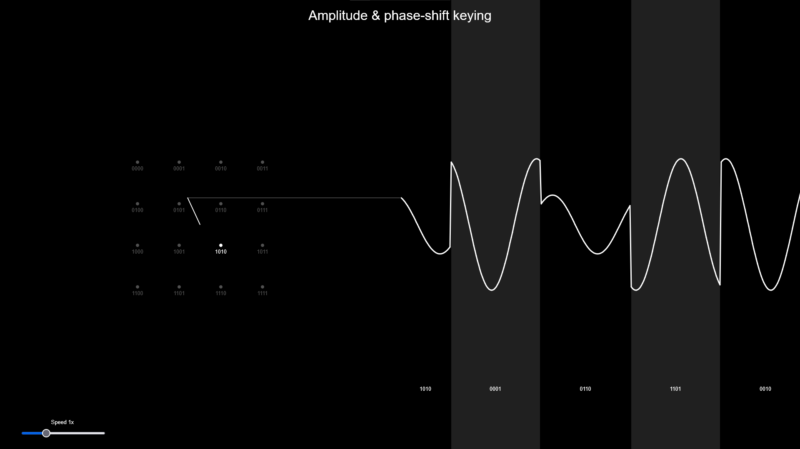

# apsk-visualization

This is a visualization of [amplitude and phase-shift keying](https://en.wikipedia.org/wiki/Amplitude_and_phase-shift_keying) using the [p5.js](https://p5js.org/) library.

The inspiration for this project was an NDC Keynote by Dylan Beattie:
[Apps, Algorithms and Abstractions: Decoding our Digital World](https://www.youtube.com/watch?v=TPS-eFmdepw&t=996s).

---
